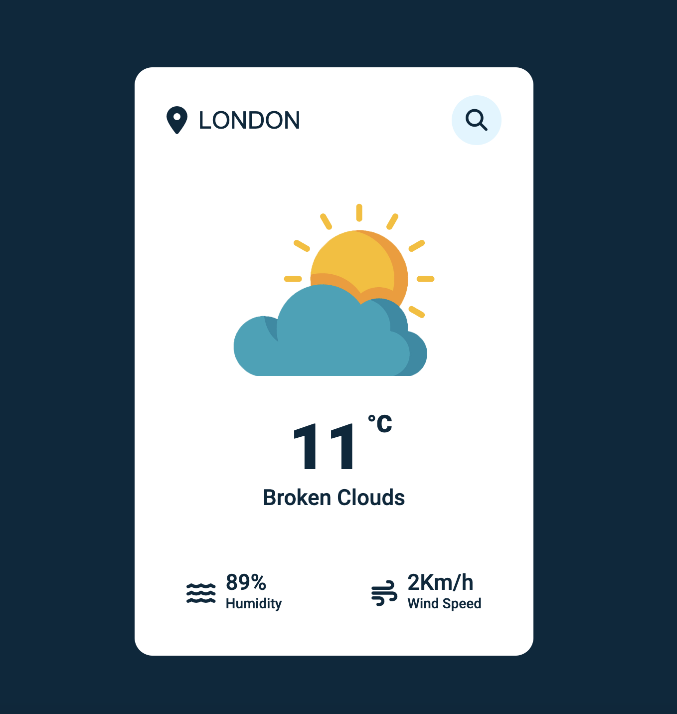

# Проект ["Weather-App"](https://prokopenko-nikita-dev.github.io/Weather-App/)

## Проект "Weather-App" - приложение о погоде. 
По запросу вы можете узнать какая погода в конкретном городе (температура, идет ли дождь/снег, какая скорость ветра).

Работает на API https://openweathermap.org/

